# HW4 - 20201068 Kim Sungnyoung

## Problem 1
### Result
|Orig|Layer More|Hidden More|
|:-:|:-:|:-:|
||||
|0.1618|0.2861|0.117|

### Discussion
On this experiment, I compared how the model dimensions affect the result; layer and hidden.  

As a results, the model with more layers(depper model) is poor than the one with more hidden layers(wide model).
This is because with just more layers, the model tends to be fit with more time or iterations. Thus, the model with more hidden is be more fit with data in less time or iterations; its loss decreases.  

### Command Lines and Arguments
```pwsh
> python cs285/scripts/run_hw4.py -cfg experiments/mpc/halfcheetah_0_iter/orig.yaml
> python cs285/scripts/run_hw4.py -cfg experiments/mpc/halfcheetah_0_iter/layer_more.yaml
> python cs285/scripts/run_hw4.py -cfg experiments/mpc/halfcheetah_0_iter/hidden_more.yaml
```

#### Configs
`orig.yaml`
```yaml
env_name: cheetah-cs285-v0
exp_name: cheetah_0iter

base_config: mpc
num_layers: 1
hidden_size: 32

num_iters: 1
initial_batch_size: 20000
num_agent_train_steps_per_iter: 500
num_eval_trajectories: 0
```

`layer_more.yaml`
```yaml
env_name: cheetah-cs285-v0
exp_name: cheetah_0iter_layer_more

base_config: mpc
num_layers: 8
hidden_size: 32

num_iters: 1
initial_batch_size: 20000
num_agent_train_steps_per_iter: 500
num_eval_trajectories: 0
```

`hidden_more.yaml`
```yaml
env_name: cheetah-cs285-v0
exp_name: cheetah_0iter_hidden_more

base_config: mpc
num_layers: 1
hidden_size: 64

num_iters: 1
initial_batch_size: 20000
num_agent_train_steps_per_iter: 500
num_eval_trajectories: 0
```

## Problem 2
### Result
|Loss|Eval Return|
|:-:|:-:|
||-25.41|

### Discussion
The value of -25.41 means the model is trained kind of successfully. But still the eval return is negative; there's need the breakthrough with this problem.  

Since the number of steps is just 20, this result is simply due to the lack of steps.  
And the criterial is soley based on distance; there should be more sophicticated criterial to learn.  

### Command Lines and Arguments
```pwsh
> python cs285/scripts/run_hw4.py -cfg experiments/mpc/obstacles_1_iter.yaml
```

#### Configs
`obstacles_1_iter.yaml`
```yaml
env_name: obstacles-cs285-v0
exp_name: obstacles_single

base_config: mpc
num_layers: 2
hidden_size: 250

num_iters: 1
initial_batch_size: 5000
num_agent_train_steps_per_iter: 20
num_eval_trajectories: 20
mpc_horizon: 10
mpc_strategy: random
```

## Problem 3
### Result
|Obstacles|Reacher|Halfcheetah|
|:-:|:-:|:-:|
|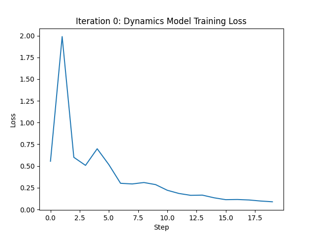|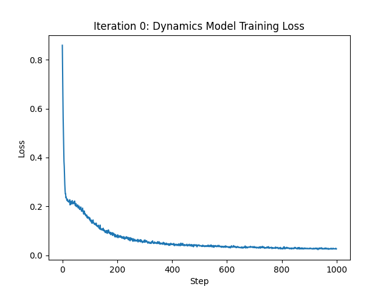|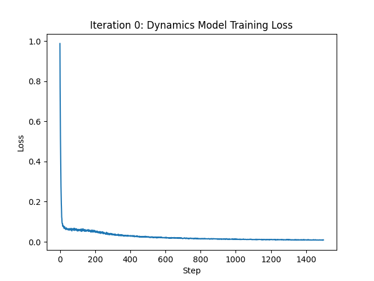|
|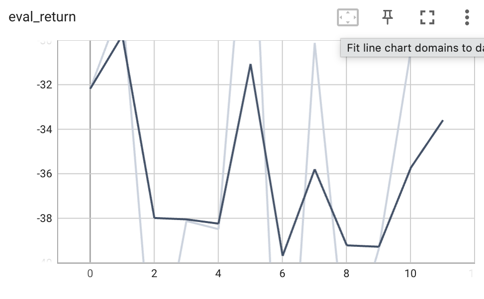|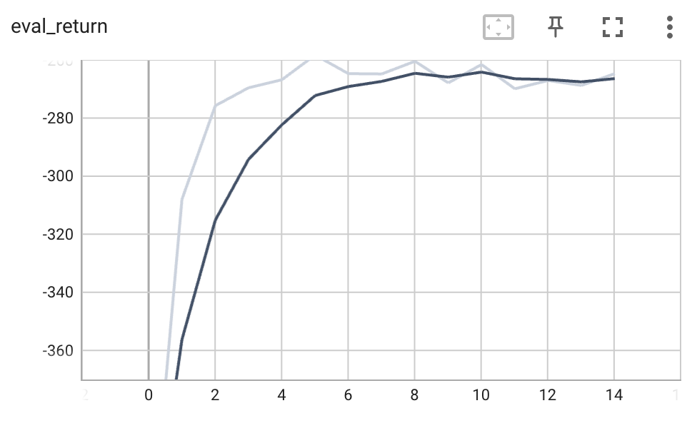|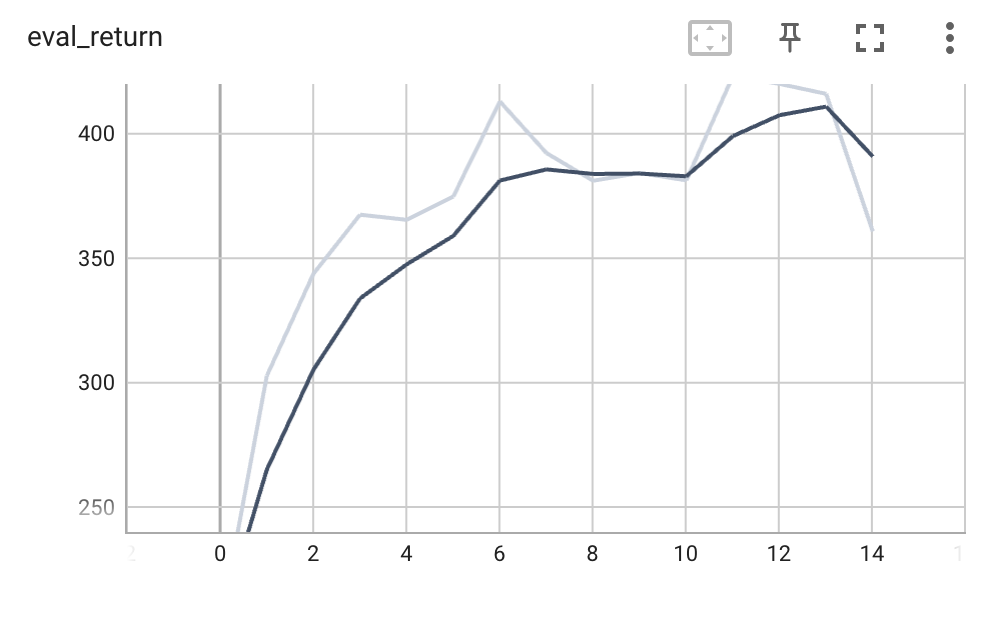|

### Discussion
#### On-Policy Iterative Training and Distribution Shift
The primary reason on-policy iterative training outperforms training on purely random data is the mitigation of **distribution shift**. When a dynamics model is trained only on random data, it learns the physics of the environment only in regions explored by a random policy. However, when we use this model for planning (MPC) to maximize rewards, the controller often steers the agent into high-reward regions that the random policy never visited. In these new states, the model's predictions are often inaccurate, leading to a failure in planning. 

By iteratively collecting data using the current MPC policy (Step 3) and aggregating it into the replay buffer (Step 4), we ensure that the dynamics model is trained on the exact state-action distributions it encounters during task execution. This "DAgger-like" approach for dynamics allows the model to become increasingly accurate in task-relevant regions, leading to significantly higher eval returns.

#### Improvement Patterns Across Environments
The improvement patterns differ across the three environments due to their varying complexity and horizons:
- **Obstacles**: This environment typically shows the fastest convergence. Since the task is navigation with a relatively short horizon and simple point-mass dynamics, the model quickly learns to avoid obstacles and reach the goal within a few iterations.
- **Reacher and HalfCheetah**: These environments involve continuous control of jointed robots, exhibiting more gradual improvement. The non-linear dynamics of the robotic arms and legs are harder to model accurately. HalfCheetah, in particular, requires a longer horizon (15 steps) and a very stable model to maintain a running gait without falling or stalling. As a result, we see a steady increase in evaluation returns over more iterations as the replay buffer grows and the model refines its understanding of these complex motions.

#### Model Error and Replay Buffer Growth
As the replay buffer grows with each iteration, the dynamics model is exposed to a richer and more diverse set of transitions. Initially, when the agent explores new strategies, the model error might fluctuate or temporarily increase. However, as more on-policy data is collected, the model's accuracy on the trajectories that matter for high performance improves. This synergy between the expanding dataset and the retraining process is what allows the agent to eventually master the tasks, as observed in the evaluation curves.

### Command Lines and Arguments
```pwsh
> python cs285/scripts/run_hw4.py -cfg experiments/mpc/obstacles_multi_iter.yaml
> python cs285/scripts/run_hw4.py -cfg experiments/mpc/reacher_multi_iter.yaml
> python cs285/scripts/run_hw4.py -cfg experiments/mpc/halfcheetah_multi_iter.yaml
```

#### Configs
`obstacles_multi_iter.yaml`
```yaml
env_name: obstacles-cs285-v0
exp_name: obstacles_multi

base_config: mpc
num_layers: 2
hidden_size: 250

num_iters: 12
initial_batch_size: 5000
batch_size: 1000
num_agent_train_steps_per_iter: 20
num_eval_trajectories: 20
mpc_horizon: 10
mpc_strategy: random
```

`reacher_multi_iter.yaml`
```yaml
env_name: reacher-cs285-v0
exp_name: reacher_multi

base_config: mpc
num_layers: 2
hidden_size: 250

num_iters: 15
initial_batch_size: 5000
batch_size: 5000
num_agent_train_steps_per_iter: 1000
num_eval_trajectories: 10
mpc_horizon: 10
mpc_strategy: random
```

`halfcheetah_multi_iter.yaml`
```yaml
env_name: cheetah-cs285-v0
exp_name: cheetah_multi

base_config: mpc
num_layers: 2
hidden_size: 250

num_iters: 15
initial_batch_size: 5000
batch_size: 5000
num_agent_train_steps_per_iter: 1500
num_eval_trajectories: 10
mpc_horizon: 15
mpc_strategy: random
```

## Problem 4
### Result
#### Orig
|Loss|Eval Return|
|:-:|:-:|
||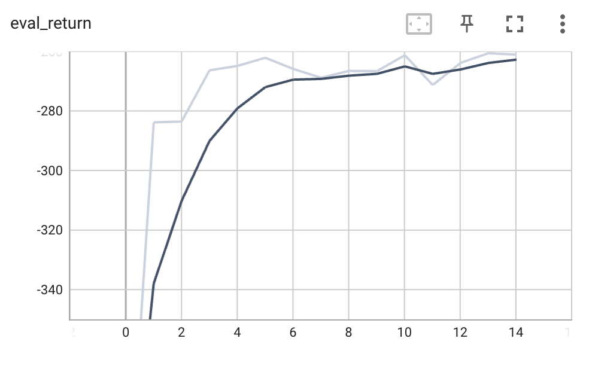|

#### Ensemble
|-|Loss|Eval Return|
|:-:|:-:|:-:|
|Less (1)|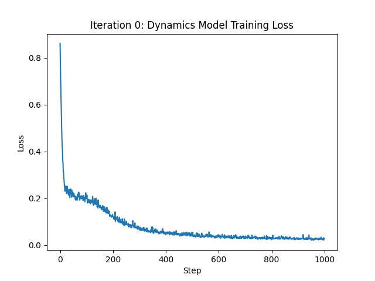|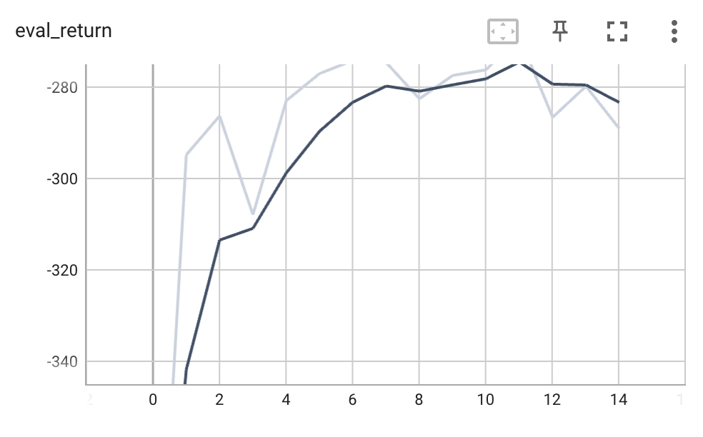|
|More (5)|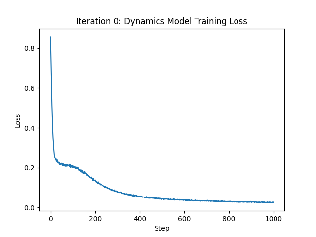|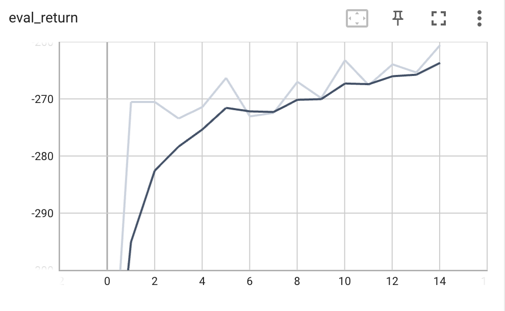|

#### Action Sequence
|-|Loss|Eval Return|
|:-:|:-:|:-:|
|Less (500)|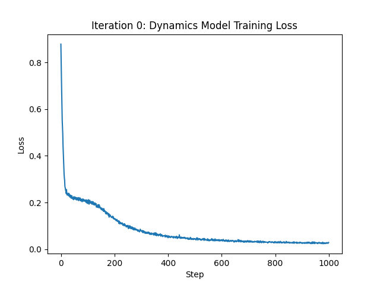|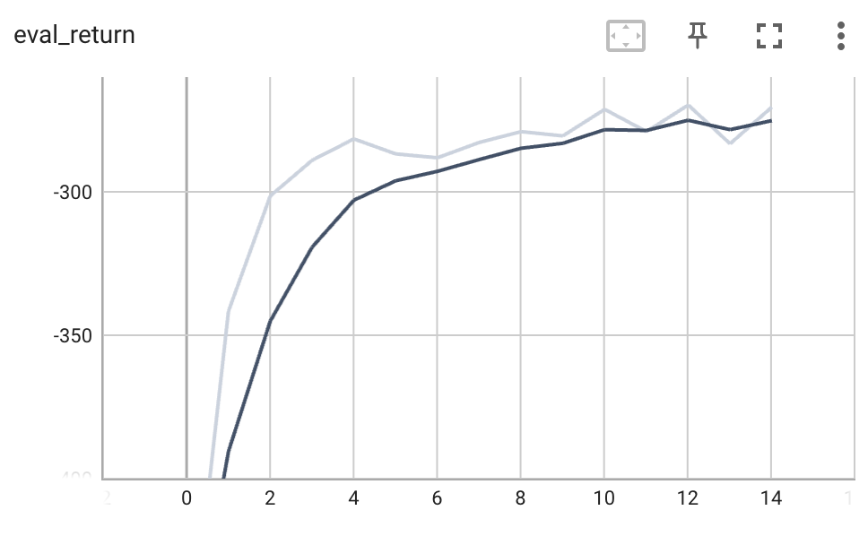|
|More (2000)|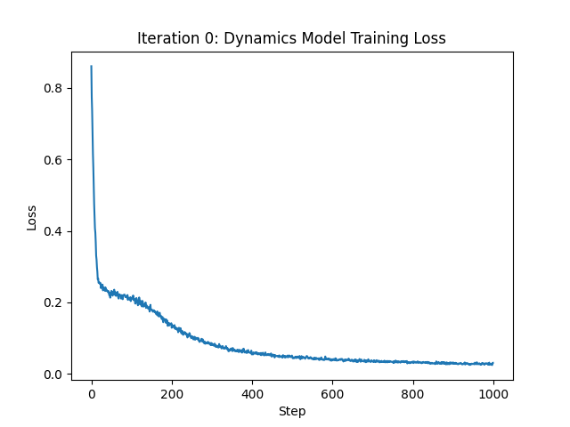|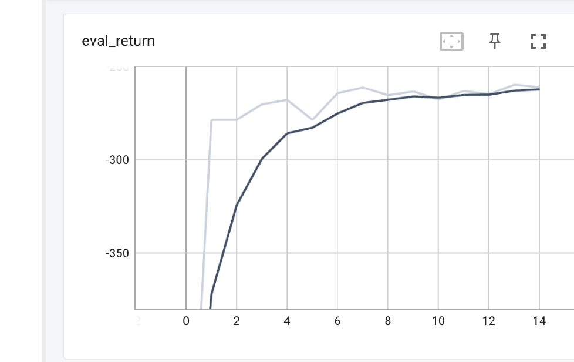|

#### Horizon
|-|Loss|Eval Return|
|:-:|:-:|:-:|
|Less (5)|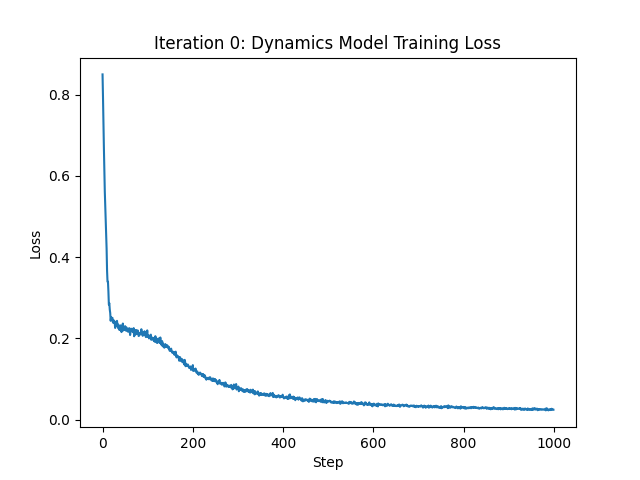|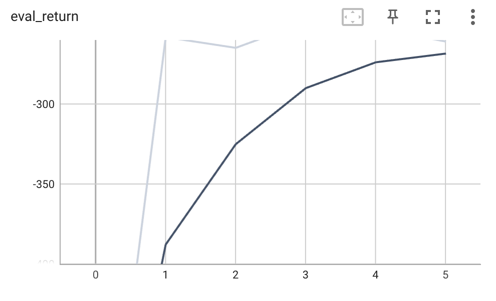|
|More (20)||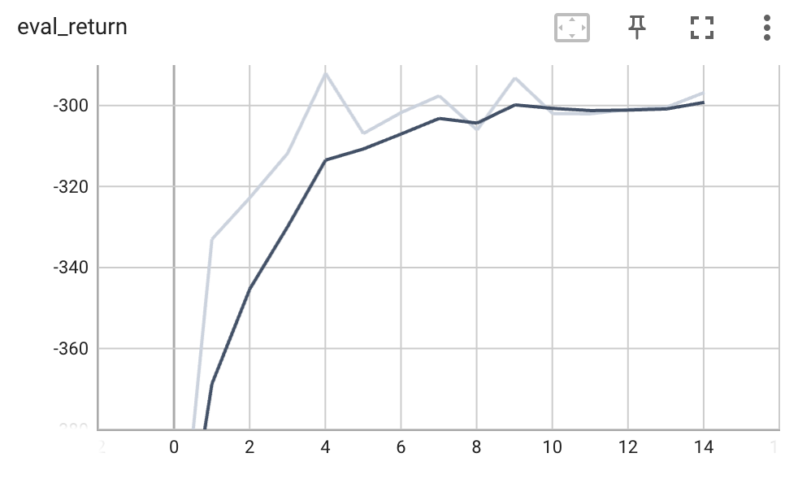|

### Discussion
#### Ensemble Size
The ensemble size plays a crucial role in the robustness of the dynamics model.
- **Ensemble Size 1 (-289.07)**: With only a single model, the agent is highly susceptible to model inaccuracies and overfitting. The planning process can exploit regions where the single model's predictions are wrong, leading to poor real-world performance.
- **Ensemble Size 3 (Baseline, -261.08)**: Increasing the ensemble size significantly improves the evaluation return. By averaging predictions (or taking the mean of the next state), we reduce the impact of individual model errors and provide a more stable signal for MPC.
- **Ensemble Size 5 (-260.59)**: Further increasing the ensemble size provides marginal benefits. While it theoretically offers more robustness, the complexity of the Reacher environment might not require such a large ensemble, or the gains are diminishing compared to the increased computational cost.

#### Number of Action Sequences
The number of action sequences sampled in the random shooting MPC determines the quality of the approximate optimization.
- **500 Sequences (-270.46)**: Sampling fewer sequences leads to a coarser search of the action space. The probability of finding a high-reward trajectory decreases, resulting in lower evaluation returns.
- **1000 Sequences (Baseline, -261.08)**: Increasing the samples to 1000 provides better coverage, allowing the agent to find more effective plans.
- **2000 Sequences (-261.18)**: Doubling the samples again shows almost no improvement over 1000. This suggests that 1000 sequences are already sufficient to find near-optimal paths in the Reacher environment's relatively low-dimensional action space.

#### Planning Horizon
The planning horizon represents the trade-off between foresight and model reliability.
- **Horizon 5 (-260.96)**: A shorter horizon focuses on immediate rewards. In the Reacher task, where the goal is often reachable within a few steps if the arm is already close, a horizon of 5 performs similarly to the baseline of 10.
- **Horizon 10 (Baseline, -261.08)**: The default horizon provides a good balance, allowing the agent to plan far enough ahead to reach distant targets while maintaining prediction accuracy.
- **Horizon 20 (-296.78)**: Surprisingly, a longer horizon significantly degrades performance. This is a classic issue in model-based RL: **compounding model error**. As the model predicts further into the future, small inaccuracies in each step accumulate, making the predictions at step 20 highly unreliable. The MPC optimization then bases its decisions on these "hallucinated" future states, leading to poor action choices in the current step.

In conclusion, for the Reacher task, an ensemble size of 3 and 1000 action sequences are sufficient, while a moderate planning horizon of 10 is optimal to avoid the pitfalls of compounding prediction errors.

### Command Lines and Arguments
```pwsh
> python cs285/scripts/run_hw4.py -cfg experiments/mpc/reacher_ablations/orig.yaml

> python cs285/scripts/run_hw4.py -cfg experiments/mpc/reacher_ablations/ensemble_less.yaml
> python cs285/scripts/run_hw4.py -cfg experiments/mpc/reacher_ablations/ensemble_more.yaml

> python cs285/scripts/run_hw4.py -cfg experiments/mpc/reacher_ablations/action_seq_less.yaml
> python cs285/scripts/run_hw4.py -cfg experiments/mpc/reacher_ablations/action_seq_more.yaml

> python cs285/scripts/run_hw4.py -cfg experiments/mpc/reacher_ablations/horizon_less.yaml
> python cs285/scripts/run_hw4.py -cfg experiments/mpc/reacher_ablations/horizon_more.yaml
```

#### Configs
`orig.yaml`
```yaml
env_name: reacher-cs285-v0
exp_name: reacher_ablation

base_config: mpc
num_layers: 2
hidden_size: 250

num_iters: 15
initial_batch_size: 5000
batch_size: 800
num_agent_train_steps_per_iter: 1000
num_eval_trajectories: 10
mpc_strategy: random

# change these!
mpc_num_action_sequences: 1000
mpc_horizon: 10
ensemble_size: 3
```

`ensemble_less.yaml`
```yaml
env_name: reacher-cs285-v0
exp_name: reacher_ablation_ensemble_less

base_config: mpc
num_layers: 2
hidden_size: 250

num_iters: 15
initial_batch_size: 5000
batch_size: 800
num_agent_train_steps_per_iter: 1000
num_eval_trajectories: 10
mpc_strategy: random

# change these!
mpc_num_action_sequences: 1000
mpc_horizon: 10
ensemble_size: 1
```

`ensemble_more.yaml`
```yaml
env_name: reacher-cs285-v0
exp_name: reacher_ablation_ensemble_more

base_config: mpc
num_layers: 2
hidden_size: 250

num_iters: 15
initial_batch_size: 5000
batch_size: 800
num_agent_train_steps_per_iter: 1000
num_eval_trajectories: 10
mpc_strategy: random

# change these!
mpc_num_action_sequences: 1000
mpc_horizon: 10
ensemble_size: 5
```

`action_seq_less.yaml`
```yaml
env_name: reacher-cs285-v0
exp_name: reacher_ablation_action_seq_less

base_config: mpc
num_layers: 2
hidden_size: 250

num_iters: 15
initial_batch_size: 5000
batch_size: 800
num_agent_train_steps_per_iter: 1000
num_eval_trajectories: 10
mpc_strategy: random

# change these!
mpc_num_action_sequences: 500
mpc_horizon: 10
ensemble_size: 3
```

`action_seq_more.yaml`
```yaml
env_name: reacher-cs285-v0
exp_name: reacher_ablation_action_seq_more

base_config: mpc
num_layers: 2
hidden_size: 250

num_iters: 15
initial_batch_size: 5000
batch_size: 800
num_agent_train_steps_per_iter: 1000
num_eval_trajectories: 10
mpc_strategy: random

# change these!
mpc_num_action_sequences: 2000
mpc_horizon: 10
ensemble_size: 3
```

`horizon_less.yaml`
```yaml
env_name: reacher-cs285-v0
exp_name: reacher_ablation_horizon_less

base_config: mpc
num_layers: 2
hidden_size: 250

num_iters: 15
initial_batch_size: 5000
batch_size: 800
num_agent_train_steps_per_iter: 1000
num_eval_trajectories: 10
mpc_strategy: random

# change these!
mpc_num_action_sequences: 1000
mpc_horizon: 5
ensemble_size: 3
```

`horizon_more.yaml`
```yaml
env_name: reacher-cs285-v0
exp_name: reacher_ablation_horizon_more

base_config: mpc
num_layers: 2
hidden_size: 250

num_iters: 15
initial_batch_size: 5000
batch_size: 800
num_agent_train_steps_per_iter: 1000
num_eval_trajectories: 10
mpc_strategy: random

# change these!
mpc_num_action_sequences: 1000
mpc_horizon: 20
ensemble_size: 3
```

## Problem 5
### Result
### Discussion
### Command Lines and Arguments
```pwsh
> python cs285/scripts/run_hw4.py -cfg experiments/mpc/halfcheetah_cem/orig.yaml
> python cs285/scripts/run_hw4.py -cfg experiments/mpc/halfcheetah_cem/iter2.yaml
```

#### Configs
`orig.yaml`
```yaml
env_name: cheetah-cs285-v0
exp_name: cheetah_cem

base_config: mpc
num_layers: 2
hidden_size: 250

num_iters: 5
initial_batch_size: 5000
batch_size: 5000
num_agent_train_steps_per_iter: 1500
num_eval_trajectories: 10
mpc_horizon: 15
mpc_strategy: cem
cem_num_iters: 4
cem_num_elites: 5
cem_alpha: 1
```

`iter2.yaml`
```yaml
env_name: cheetah-cs285-v0
exp_name: cheetah_cem_iter2

base_config: mpc
num_layers: 2
hidden_size: 250

num_iters: 5
initial_batch_size: 5000
batch_size: 5000
num_agent_train_steps_per_iter: 1500
num_eval_trajectories: 10
mpc_horizon: 15
mpc_strategy: cem
cem_num_iters: 2
cem_num_elites: 5
cem_alpha: 1
```

## Problem 6
Since hw4 from [homework_spring2026](https://github.com/berkeleydeeprlcourse/homework_spring2026/tree/main) is differ from our hw4, I presume hw4 is from [homework_fall2023](https://github.com/berkeleydeeprlcourse/homework_fall2023) and used it.  
But those code bases are not quite competiable with each other; SAC from version Spring-2026 is not quite working well with version Fall-2023.

I couldn't make the code from Spring-2026 working with Fall-2023.
