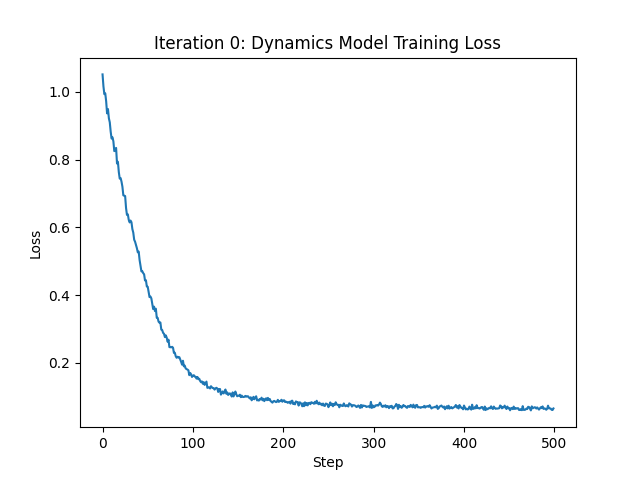
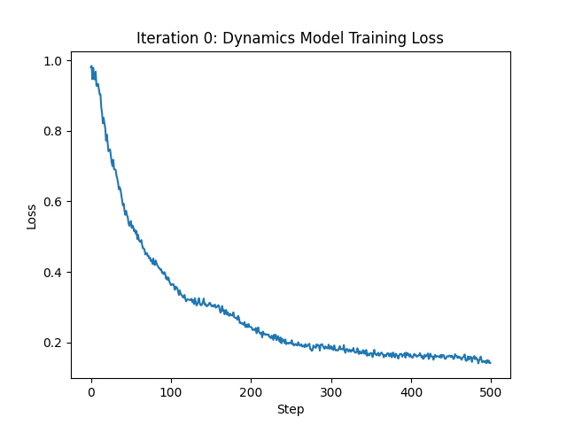
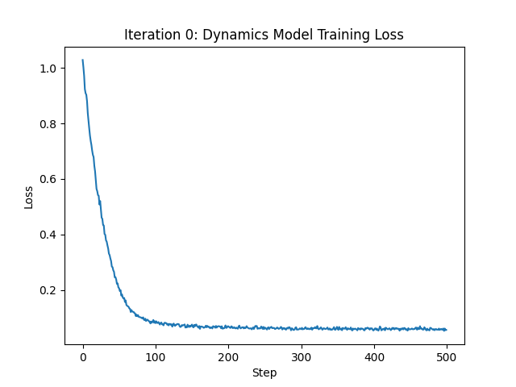

# HW4 - 20201068 Kim Sungnyoung

## Problem 1
### Result
|Orig|Layer More|Hidden More|
|:-:|:-:|:-:|
||||
|0.1618|0.2861|0.117|

### Discussion
On this experiment, I compared how the model dimensions affect the result; layer and hidden.  

As a results, the model with more layers(depper model) is poor than the one with more hidden layers(wide model).
This is because with just more layers, the model tends to be fit with more time or iterations. Thus, the model with more hidden is be more fit with data in less time or iterations; its loss decreases.  

### Command Lines and Arguments
```pwsh
> python cs285/scripts/run_hw4.py -cfg experiments/mpc/halfcheetah_0_iter/orig.yaml
> python cs285/scripts/run_hw4.py -cfg experiments/mpc/halfcheetah_0_iter/layer_more.yaml
> python cs285/scripts/run_hw4.py -cfg experiments/mpc/halfcheetah_0_iter/hidden_more.yaml
```

#### Configs
`orig.yaml`
```yaml
env_name: cheetah-cs285-v0
exp_name: cheetah_0iter

base_config: mpc
num_layers: 1
hidden_size: 32

num_iters: 1
initial_batch_size: 20000
num_agent_train_steps_per_iter: 500
num_eval_trajectories: 0
```

`layer_more.yaml`
```yaml
env_name: cheetah-cs285-v0
exp_name: cheetah_0iter_layer_more

base_config: mpc
num_layers: 8
hidden_size: 32

num_iters: 1
initial_batch_size: 20000
num_agent_train_steps_per_iter: 500
num_eval_trajectories: 0
```

`hidden_more.yaml`
```yaml
env_name: cheetah-cs285-v0
exp_name: cheetah_0iter_hidden_more

base_config: mpc
num_layers: 1
hidden_size: 64

num_iters: 1
initial_batch_size: 20000
num_agent_train_steps_per_iter: 500
num_eval_trajectories: 0
```

## Problem 2
### Result
|Loss|Eval Return|
|:-:|:-:|
||-25.41|

### Discussion
The value of -25.41 means the model is trained kind of successfully. But still the eval return is negative; there's need the breakthrough with this problem.  

Since the number of steps is just 20, this result is simply due to the lack of steps.  
And the criterial is soley based on distance; there should be more sophicticated criterial to learn.  

### Command Lines and Arguments
```pwsh
> python cs285/scripts/run_hw4.py -cfg experiments/mpc/obstacles_1_iter.yaml
```

#### Configs
`obstacles_1_iter.yaml`
```yaml
env_name: obstacles-cs285-v0
exp_name: obstacles_single

base_config: mpc
num_layers: 2
hidden_size: 250

num_iters: 1
initial_batch_size: 5000
num_agent_train_steps_per_iter: 20
num_eval_trajectories: 20
mpc_horizon: 10
mpc_strategy: random
```

## Problem 3
### Result
### Discussion
### Command Lines and Arguments
#### Configs

## Problem 4
### Result
### Discussion
### Command Lines and Arguments
#### Configs

## Problem 5
### Result
### Discussion
### Command Lines and Arguments
#### Configs

## Problem 6
### Result
### Discussion
### Command Lines and Arguments
#### Configs
